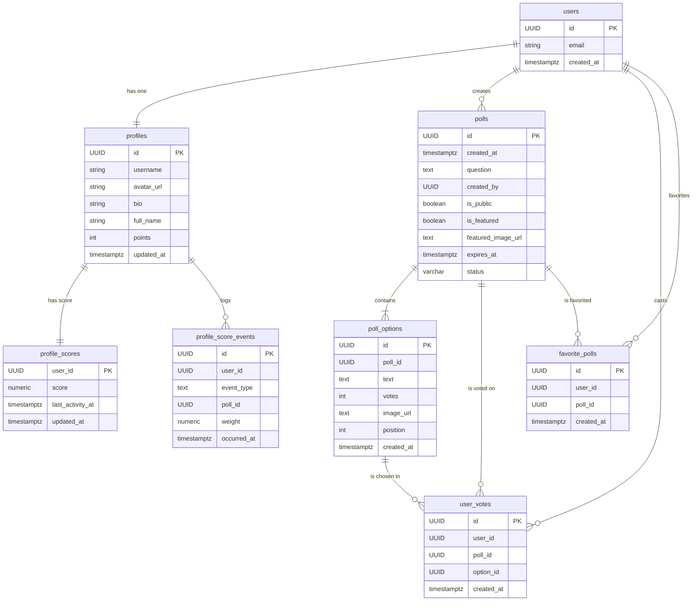

# Heyversus

🔗 Link : https://heyversus.vercel.app/
📦 Version : v0.7.0

**Heyversus**는 사용자가 직접 투표를 생성하고 참여할 수 있는 동적인 웹 애플리케이션입니다. Next.js와 Supabase를 기반으로 구축되어 있으며, 실시간 투표 결과와 사용자 인증, 포인트 시스템을 제공합니다.

## ✨ 주요 기능

- **사용자 인증**: Supabase Auth를 이용한 간편한 회원가입, 로그인, 로그아웃 기능.
- **투표 생성 및 관리**:
  - **다양한 옵션**: 질문과 여러 선택지를 포함하는 투표를 생성할 수 있습니다.
  - **공개/비공개 설정**: 투표를 모든 사람이 참여할 수 있도록 공개하거나, 로그인한 사용자만 참여하도록 제한할 수 있습니다.
  - **만료 시간 설정**: 투표 마감 시간을 설정하여 기간이 지난 투표는 자동으로 종료됩니다.
- **실시간 투표 시스템**:
  - **익명 투표**: 공개 투표는 로그인하지 않은 사용자도 참여할 수 있습니다.
  - **중복 투표 방지**: 로그인 사용자는 DB를 통해, 비로그인 사용자는 로컬 스토리지를 통해 중복 투표를 효과적으로 방지합니다.
- **대표 투표**: 관리자가 지정한 '오늘의 투표'를 메인 페이지에 노출하여 사용자 참여를 유도합니다.
- **포인트 및 랭킹**: 투표에 참여할 때마다 포인트를 획득하고, 다른 사용자들과의 순위를 `SCORE` 페이지에서 확인할 수 있습니다.
- **즐겨찾기 관리**: 로그인 사용자는 관심 있는 투표를 즐겨찾기에 추가하고 `/favorites` 페이지에서 모아볼 수 있습니다.
- **랜덤 옵션 추천**: 상세 페이지에서 돌림판 모달로 랜덤 옵션을 추천받고, 자동 선택/토스트 안내 후 직접 투표할 수 있습니다.
- **프로필 관리**: `/account` 페이지에서 아바타 이미지, 사용자명, 이름, 자기소개를 편집할 수 있으며, 변경사항은 즉시 Navbar에 반영됩니다.
- **사용자 경험(UX) 최적화**:
  - **다크/라이트 모드**: 사용자 선호도에 맞는 테마를 제공하고 실시간으로 전환할 수 있습니다. 시스템 설정을 자동으로 감지하며, Navbar의 토글 버튼으로 즉시 변경 가능합니다.
  - **그라디언트 디자인**: 모든 버튼과 배지에 그라디언트 효과를 적용하여 시각적으로 매력적이고 현대적인 UI를 제공합니다.
  - **신속한 피드백**: `sonner` 라이브러리를 활용하여 직관적인 Toast 알림을 제공합니다.
  - **자동 리디렉션**: 로그인 후 이전에 보던 페이지로 자동 이동하여 사용 흐름이 끊기지 않도록 합니다.
  - **데이터 자동 갱신**: 페이지에 다시 방문했을 때 최신 투표 데이터를 자동으로 불러와 보여줍니다.
  - **반응형 디자인**: Mobile-First 전략으로 모든 기기에서 최적화된 경험을 제공합니다 (360px~1920px).

## 🛠️ 기술 스택

- **프레임워크**: Next.js 15 (App Router)
- **언어**: TypeScript
- **스타일링**: Tailwind CSS v4
- **백엔드 (BaaS)**: Supabase (Auth, PostgreSQL, Storage, Edge Functions)
- **UI 컴포넌트**: shadcn/ui, Tailwind CSS 유틸리티 + `class-variance-authority`
- **폼 & 검증**: react-hook-form, Zod, @hookform/resolvers
- **아이콘**: lucide-react
- **데이터 페칭**: `@tanstack/react-query`
- **상태 관리**: React Query 캐시, Zustand 스토어, Supabase Session Provider
- **테마 관리**: next-themes (다크/라이트 모드)
- **폰트 최적화**: `next/font` (Inter)
- **알림**: Sonner (Toast notifications)
- **에러 모니터링**: Sentry (Error tracking, Performance monitoring, Session replay)
- **코드 품질**: ESLint, Prettier, Husky, lint-staged
- **테스트**: Jest, React Testing Library
- **배포**: Vercel

## 📁 프로젝트 구조

```
/
├── public/              # 정적 에셋 (이미지, 폰트 등)
├── scripts/             # 시딩/배치 스크립트
├── src/
│   ├── __tests__/       # Jest + RTL 테스트 코드
│   ├── app/             # Next.js App Router 페이지 및 레이아웃
│   │   ├── api/         # Route handlers (REST API)
│   │   ├── auth/        # OAuth/세션 콜백 라우트
│   │   ├── signin/      # 로그인 페이지
│   │   ├── signup/      # 회원가입 페이지
│   │   ├── create-poll/ # 투표 생성 페이지
│   │   ├── polls/       # 전체 투표 목록 페이지
│   │   ├── favorites/   # 즐겨찾기한 투표 목록 페이지
│   │   ├── poll/[id]/   # 투표 상세 및 결과 페이지
│   │   ├── account/     # 프로필 관리 페이지
│   │   ├── score/       # 사용자 랭킹(스코어보드) 페이지
│   │   ├── layout.tsx   # 루트 레이아웃
│   │   ├── page.tsx     # 메인 랜딩 페이지 (대표 투표)
│   │   └── globals.css  # 글로벌 스타일 및 디자인 토큰
│   ├── components/      # 재사용 가능한 UI 컴포넌트
│   │   ├── common/      # Skeleton, ErrorState, EmptyState 등 공용 컴포넌트
│   │   ├── layout/      # Navbar 등 레이아웃 컴포넌트
│   │   ├── polls/       # Poll 관련 컴포넌트
│   │   └── ui/          # shadcn 기반 기본 UI
│   ├── constants/       # 애플리케이션 상수 (storage, cache, defaults)
│   ├── hooks/           # 재사용 가능한 커스텀 훅
│   │   ├── useCurrentProfile.ts
│   │   ├── useInfinitePolls.ts
│   │   ├── useLeaderboard.ts
│   │   ├── usePollVote.ts
│   │   ├── useToggleFavorite.ts
│   │   └── useVoteStatus.ts
│   ├── lib/             # 공통 유틸리티, Supabase 클라이언트 및 서비스 계층
│   │   ├── services/    # Supabase RPC/스토리지 비즈니스 로직
│   │   ├── stores/      # Zustand 기반 전역 상태
│   │   ├── supabase/    # anon/server/service-role 클라이언트
│   │   ├── validation/  # Zod 스키마
│   │   ├── types.ts     # 공유 타입
│   │   └── utils.ts     # 공용 유틸
│   ├── providers/       # React Query 등 글로벌 Provider 구성
│   ├── instrumentation.ts # Sentry 등 Next.js instrumentation 훅
│   └── middleware.ts    # Supabase 세션 관리 미들웨어
├── references/          # 참고 문서 및 가이드
│   └── QUERY.md         # 데이터베이스 스키마 (SQL)
├── ROADMAP.md           # 개발 로드맵 및 진행 현황
└── README.md            # 프로젝트 문서
```

## 🚀 시작하기

1. 저장소를 클론합니다.
   ```bash
   git clone https://github.com/ChoiKyeongHoon/heyversus.git
   cd heyversus
   ```
2. 의존성을 설치합니다.
   ```bash
   npm install
   ```
3. 환경 변수를 설정합니다. `.env.local` 파일을 생성하고 아래 키를 채웁니다.

   ```bash
   # Supabase
   NEXT_PUBLIC_SUPABASE_URL=<your-supabase-url>
   NEXT_PUBLIC_SUPABASE_ANON_KEY=<your-supabase-anon-key>
   SUPABASE_SERVICE_ROLE_KEY=<optional-service-role-key-for-seeding>

   # Sentry (선택사항 - 에러 모니터링)
   NEXT_PUBLIC_SENTRY_DSN=<your-sentry-dsn>
   SENTRY_ORG=<your-sentry-org>
   SENTRY_PROJECT=<your-sentry-project>
   SENTRY_AUTH_TOKEN=<your-sentry-auth-token>
   ```

   `.env.local.example` 파일을 참고하세요.

4. 개발 서버를 실행합니다.
   ```bash
   npm run dev
   ```
5. (선택) 샘플 데이터를 넣으려면 Supabase에 로그인된 상태에서 시딩 스크립트를 실행합니다.
   ```bash
   npm run db:seed
   ```
6. 변경 사항을 커밋하기 전에 린트를 실행합니다.
   ```bash
   npm run lint
   ```
7. Jest 기반 단위 테스트를 실행하려면 아래 명령을 사용합니다.
   ```bash
   npm run test
   ```
8. 점수 집계를 수동으로 실행하려면 다음을 사용합니다.
   ```bash
   npm run scores:refresh
   ```
   환경 변수:
   - `NEXT_PUBLIC_SUPABASE_URL`
   - `SUPABASE_SERVICE_ROLE_KEY`
   - 선택: `SCORE_REFRESH_LIMIT` (기본 500), `SCORE_REFRESH_OFFSET` (기본 0)
9. 점수 집계를 매일 자동 실행하려면 GitHub Actions 시크릿을 설정합니다.
   - 저장소 Settings → Secrets → Actions에 아래를 추가:
     - `NEXT_PUBLIC_SUPABASE_URL`
     - `SUPABASE_SERVICE_ROLE_KEY`
     - (선택) `SCORE_REFRESH_LIMIT`
   - 워크플로: `.github/workflows/score-refresh.yml` (매일 00:00 UTC 실행, 수동 실행도 가능)

## 📊 데이터베이스 스키마

`references/QUERY.md` 파일은 전체 데이터베이스 스키마(SQL)를 정의합니다. 주요 테이블 간의 관계는 다음과 같습니다.



**정렬 규칙**: 모든 목록/상세에서 옵션은 `position → created_at → id` 순으로 정렬되며, 생성 순서가 유지됩니다. `poll_options.position`은 옵션 생성 시 자동으로 채워집니다.

## 📌 업데이트 기록

### v0.7.0

- **테스트 안정화**: `/api/polls/[id]` 라우트의 `getPollById`를 모킹해 404/403 케이스가 500으로 처리되지 않도록 수정하고 `npm run test`를 통과했습니다.
- **로드맵 정리**: Step 19(투표 이미지 업로드)를 완료 상태로 반영했습니다.
- **투표 이미지 업로드 베타**: `poll_images` 버킷(비공개, 10MB, JPEG/PNG/WebP)과 서비스 롤/소유자 전용 RLS를 추가하고, `create_new_poll`이 `option_image_urls`를 저장하도록 확장했습니다.
- **서명 URL 렌더링**: Poll 서비스 계층이 옵션 이미지 경로를 5분 만료 서명 URL로 변환해 목록/상세/대표/즐겨찾기/내 투표에서 안전하게 이미지를 노출합니다. 서명 생성 실패 시 내부 경로를 노출하지 않고 안전하게 무시하도록 가드했습니다.
- **업로드 API/클린업**: `/api/polls/images`에서 서명 업로드 URL을 발급하고 DELETE 클린업을 지원합니다. MIME/크기(10MB) 검증을 포함했습니다.
- **생성 폼 UX**: `/create-poll`에 선택지별 이미지 업로드/미리보기/삭제, 업로드 상태·에러 표시, 업로드 중 제출 비활성, 10MB/확장자 가드를 추가했습니다.
- **이미지 호스트 허용**: `next.config.ts`에 Supabase 서명 경로(`/storage/v1/object/sign/**`)를 추가해 서명 URL 이미지를 정상 렌더링합니다.
- **문서 업데이트**: ROADMAP Step 19를 진행 중으로 갱신하고 `references/QUERY.md`에 실행용 SQL 블록을 추가했습니다.

### v0.6.9

- **/polls 초기 상태 정합성**: 서버 prefetch를 세션 클라이언트로 수행해 즐겨찾기/투표 상태가 첫 렌더부터 일치하도록 Hydration을 보정했습니다.
- **Step 18 테스트 보강**: `/api/polls` GET/POST, `/api/polls/[id]` 404/403, `usePollVote` 오류 롤백, 즐겨찾기 토글 권한 실패 플로우를 Jest + RTL로 커버했습니다.
- **Navbar 프로필 타입 보강**: `useCurrentProfile`가 `avatar_url`을 항상 포함하고 `UseQueryResult` 반환 타입을 명시했으며, TanStack v5 옵션(`gcTime`)으로 정비하고 Navbar에서 프로필 데이터를 명시적 타입으로 소비해 빌드 타입 오류 없이 동작하도록 수정했습니다.
- **API params 비동기 처리**: `/api/polls/[id]`와 `/api/polls/[id]/vote`를 Next.js 15 `params` Promise 규약에 맞춰 `await params`로 수정해 런타임 오류를 제거했습니다.
- **프로필 점수 실시간 반영**: `get_profile` RPC가 `profile_score_events`를 SECURITY DEFINER로 합산해 투표/생성 직후 프로필·Navbar 점수가 즉시 갱신되도록 수정했습니다.
- **투표/생성 후 즉시 갱신 + 부하 완화**:
  - `usePollVote`: 프로필 점수 낙관적 업데이트 + `current-profile`/`poll-detail`/`leaderboard` 무효화로 액션 직후 최신화, 필요한 키만 refetch해 트래픽 최소화.
  - `CreatePollClient`: 투표 생성 성공 시 프로필 점수를 가중치(3점)만큼 낙관적 반영하고 동일한 키를 무효화해 새 점수가 바로 표시되도록 했습니다.
- **캐시/세션 분리 착수**: `getPolls`·`getPollById`의 `unstable_cache`를 제거하고 `/api/polls`·`/api/polls/[id]`에서 `revalidate`를 삭제해 세션 의존 데이터가 캐시되지 않도록 정비했습니다.
- **QUERY.md 정리**: `get_leaderboard`·`log_score_event` 등에서 잘못된 토큰(`_`, `COUNT(*)` 이스케이프)을 수정해 Supabase SQL 실행 오류를 제거했습니다.
- **QUERY.md SQL 정리**: `log_score_event` 종료 구문 및 `get_polls_paginated` 등에서 잘못된 이스케이프/오타를 수정해 Supabase 실행 시 구문 오류를 방지했습니다.
- **즐겨찾기 무가산 고정**: 점수 이벤트 API에서 `favorite` 타입을 차단해 즐겨찾기 추가 시 포인트가 쌓이지 않도록 고정했습니다.
- **즐겨찾기 점수 제거(쿼리)**: `log_score_event` SQL 정의에서 `favorite` 이벤트를 허용/가중치 목록에서 제거해 DB 차원에서도 가산이 발생하지 않도록 했습니다.
- **프로필 점수 일원화**: 프로필/네비게이션/계정 화면이 `profile_scores` 집계 점수를 우선 사용하고 없을 때만 `profiles.points`로 폴백해 랭킹과 동일한 값을 표시합니다.
- **점수 배치 주기 변경**: `score-refresh` GitHub Actions를 매시 정각(UTC)으로 실행해 집계 신선도를 높였습니다.
- **Step 19 이미지 업로드 계획**: `references/STEP19_IMAGE_UPLOAD_PLAN.md`에 투표 이미지 업로드 설계(스토리지/RPC/프론트 UX/테스트/보안)를 정리했습니다.
- **리더보드 폴백**: `profile_scores` 집계가 비었거나 RPC 오류 시 `profiles.points` 기준으로 레이팅을 표시하도록 폴백을 추가하고, best-effort로 `refresh_profile_scores`를 트리거해 집계 누락을 줄였습니다.
- **프로필 실시간 점수 합산**: 프로필 조회 시 `profile_score_events`를 합산해 즉시 점수를 계산하고, 이벤트가 없을 때만 `profile_scores`→`profiles.points` 순으로 폴백합니다.
- **보안 패치**: React Flight/Next.js RCE 대응을 위해 Next.js를 15.5.7로 업데이트했습니다.
- **로드맵 정리**: Step 18의 필수 작업만 남기고 선택 과제를 Step 23 "지속적 개선"으로 이동했습니다. 타임라인을 Step 23까지 갱신했습니다.
- **/score 리더보드 갱신**: `get_leaderboard` RPC 기반 데이터로 `/score` 페이지를 전환하고 오류/빈 상태 가드를 추가했습니다. 구 프로필 포인트 기반 리더보드 호출은 제거했습니다.
- **점수 이벤트 API 경유**: 클라이언트에서 점수 이벤트를 `/api/score-events`로 전송하고 service role로 기록하도록 변경해 권한 오류를 제거했습니다.
- **즐겨찾기 포인트 제거**: 즐겨찾기 추가 시 점수 이벤트를 기록하지 않도록 변경했습니다.
- **투표 생성 점수 조정**: `log_score_event`에서 투표 생성(`create_poll`) 가중치를 5점으로 조정했습니다.
- **로그인 리디렉션 안정화**: 이메일/비밀번호 로그인 후 세션 생성 실패를 감지하고, `window.location.assign` 실패 시 `router.replace`로 한 번 더 리디렉션해 로그인 페이지에 머무르는 문제를 방지했습니다.
- **비로그인 투표 시 점수 로깅 스킵**: 로그인된 사용자만 투표 점수 이벤트를 기록하도록 가드해 401 오류 노출을 방지했습니다.
- **점수 이벤트 API 개선**: `/api/score-events`를 force-dynamic으로 전환하고 에러 메시지를 구체화했으며, 클라이언트 요청에 쿠키를 확실히 포함하도록 했습니다.
- **점수 이벤트 고유 제약 보정**: `profile_score_events`의 dedup 고유 제약(ux_profile_score_events_dedup)이 없으면 인덱스를 제거하고 제약으로 재생성하도록 QUERY.md에 보정 블록을 추가했습니다.
- **score_events 업데이트 보정**: `occurred_on`(generated column)을 업데이트하지 않도록 `log_score_event`의 ON CONFLICT 절을 수정했습니다.

### v0.6.8

- **점수 이벤트 확장**: `/api/polls` 투표 생성 흐름에 `log_score_event('create_poll')`를 추가해 생성 액션도 점수에 반영합니다.
- **집계 배치 경로 추가**: service role 클라이언트(`src/lib/supabase/service-role.ts`)와 점수 리프레시 스크립트(`scripts/refreshScores.ts`)를 추가해 `refresh_profile_scores`를 배치/스케줄러에서 실행할 수 있습니다.
- **GitHub Actions 크론 추가**: `.github/workflows/score-refresh.yml`로 매일 00:00 UTC에 `npm run scores:refresh`를 자동 실행하도록 워크플로를 추가했습니다.
- **점수 감가 언급 제거**: Step 18, `references/LEADERBOARD_PLAN.md`, `references/QUERY.md`에서 시간 감쇠/감가 계획을 삭제하고 합산 기반 모델로 문서를 정리했습니다.
- **Step 18 설계/문서화**: `references/LEADERBOARD_PLAN.md`에 점수 모델·감가·스키마/RLS·UX 가드레일을 정리하고 ROADMAP Step 18을 진행 중으로 업데이트했습니다.
- **리더보드 백엔드 스케폴드**: `references/QUERY.md`에 `profile_scores`/`profile_score_events` 테이블, `refresh_profile_scores`/`get_leaderboard` RPC 초안을 추가하고 dedup 인덱스용 `occurred_on` 생성 컬럼을 도입했습니다. 점수 이벤트 기록용 `log_score_event` RPC와 RLS 정책(leaderboard 공개 조회, 이벤트 로그 service_role 전용)을 추가했습니다.
- **리더보드 코드 스케폴드**: `src/lib/services/leaderboard.ts`(RPC 호출 스텁), 랭킹 타입(`src/lib/types.ts`), React Query 훅 뼈대(`src/hooks/useLeaderboard.ts`), 점수 이벤트 서비스(`src/lib/services/scoreEvents.ts`)를 추가했습니다. 투표/즐겨찾기 액션에 `log_score_event`를 연동해 이벤트 적재를 시작했습니다.
- **레거시 컴포넌트 정리**: 사용되지 않는 `src/app/polls/PollsClient.tsx`를 제거해 `/polls` 목록을 `PollsClientInfinite`로 단일화했습니다.

### v0.6.7

- **투표 플로우 단일화**: `/polls`, `/favorites` 등 리스트 화면에서는 투표/옵션 선택을 제거하고 결과·상태만 노출, 실제 투표는 상세 `/poll/[id]`에서만 진행하도록 변경.
- **상세 투표 UX 강화**: `usePollVote`가 React Query 캐시를 낙관적으로 갱신 후 실패 시 롤백하도록 개선해 투표 반영 속도와 안정성을 높였습니다.
- **Supabase RPC 보강**: `increment_vote`를 `SECURITY DEFINER` + `COALESCE(votes, 0)` + 옵션/투표 불일치 시 예외 처리로 수정해 익명 투표에서도 표 수가 안전하게 반영됩니다. (`references/QUERY.md`)
- **랜덤 옵션 돌림판**: `/poll/[id]`에 conic-gradient 모달을 추가해 랜덤 추천 → 자동 옵션 선택 하이라이트 → 토스트 안내 흐름을 제공하며, 쿨다운/중복 클릭 차단을 포함합니다.
- **옵션 순서 고정**: `poll_options.position` 컬럼을 도입하고 모든 RPC에서 `ORDER BY position, created_at, id`로 통일해 목록/상세 모두 생성 순서로 표시됩니다.
- **상세 페이지 내비게이션 가시성**: 상세 투표 카드의 뒤로가기 화살표에 `투표 목록` 텍스트 라벨을 추가해 목록 이동 경로를 명확히 안내합니다.
- **대표 투표 CTA 위계 조정**: 메인 대표 투표 카드의 버튼 배치를 `결과 보기 → 투표하기` 순서로 정렬해 주요 CTA(투표하기)를 오른쪽에 배치했습니다.
- **문서 업데이트**: ROADMAP Step 8.3을 완료 상태로 표시하고 투표 플로우 단일화/투표 RPC 보강 현황을 문서에 반영했습니다.

### v0.6.6

- **이미지 최적화**: `next/image` 기본 포맷을 AVIF/WebP로 지정하고 품질을 70으로 낮춰 네트워크 페이로드를 절감했습니다.
- **네트워크 티닝**: Supabase Storage 및 images.vercel.com에 `preconnect`/`dns-prefetch`를 추가해 초기 연결 지연을 줄였습니다.
- **접근성/스타일**: 이미지 없는 VS 배지 대비 강화, 푸터 텍스트 대비 개선.
- **정리**: Sentry 의존성을 제거하고 번들 분석 스크립트(`npm run analyze`)를 추가했습니다.

### v0.6.5

- **Polls 페이지 리뉴얼**: `/polls` 상단에 `PollsHero` 섹션을 추가해 총 투표 수·진행 중·마감 임박 등 핵심 지표와 CTA(새 투표 만들기, 즐겨찾기 보기)를 한눈에 보여줍니다.
- **카테고리 탭**: `최신/인기/마감 임박` 탭이 URL 파라미터와 연동되어 정렬/필터 프리셋을 즉시 적용합니다.
- **새 PollCard 컴포넌트**: 옵션 카드, 득표율 Progress, 즐겨찾기 버튼, 상태 배지를 통합한 카드 UI를 `@/components/polls/PollCard.tsx`로 분리해 재사용성과 접근성을 강화했습니다.
- **FavoriteToggle 공용화**: 즐겨찾기 아이콘 토글을 `@/components/polls/FavoriteToggle.tsx`로 분리해 목록/상세 페이지 모두 같은 UX(비로그인 시 로그인 리다이렉트, 로딩 시 비활성)로 동작합니다.
- **필터바 & 통계 개선**: 필터 영역을 반투명 카드로 정리하고, 즐겨찾기 CTA/빠른 필터 안내를 추가해 탐색 → 참여 플로우를 단순화했습니다.
- **스코어 보드 리디자인**: `/score` 페이지도 `PollsHero` 패턴을 사용해 지표/CTA를 정리하고, Top 3 카드 + 전체 랭킹 테이블을 토큰 스타일로 재구성해 브랜드 일관성을 맞췄습니다.
- **상세 페이지 인사이트 섹션**: `/poll/[id]`에 총 투표 수, 상태, 남은 시간, 선두 옵션을 보여주는 요약 카드를 추가해 “결과·투표 보기” 버튼이 제공하는 정보 가치를 높였습니다.
- **API & 로더 안정화**: 공용 `GradientSpinner` 로더를 도입해 로딩 UI를 통일했고, `/api/polls/[id]`가 `createClient()`를 직접 사용하도록 고쳐 `cookies()` 관련 오류를 방지했습니다.
- **문서 업데이트**: ROADMAP Step 15과 타임라인을 "✅ 완료"로 갱신하고, README 버전을 v0.6.5로 올렸습니다.
- **대표 투표 UX 보완**: `FeaturedPollClient`가 최신 `next/image` API(`onLoad`)를 사용하도록 정리하고, `useVoteStatus` 초기 동기화 방식을 고쳐 로그인 사용자도 즉시 “투표 완료” 상태를 확인할 수 있게 했습니다.

### v0.6.4

- **투표 상태 훅 안정화**: `useVoteStatus`가 전달받은 투표 ID 목록을 비교한 뒤에만 상태를 갱신하도록 수정해, CSR 환경에서 무한 업데이트가 발생하지 않도록 했습니다.
- **/create-poll 서버 가드**: 페이지를 서버 컴포넌트로 변환해 인증되지 않은 사용자는 SSR 단계에서 `/signin?redirect=/create-poll`로 즉시 리다이렉션되며, 클라이언트에서는 Supabase `onAuthStateChange` 이벤트로 세션 만료를 감지합니다.
- **대표 투표 카드 에러 수정**: `FeaturedPollClient`에서 제거된 `isStatusLoading` 변수를 계속 참조해 런타임 오류가 나던 문제를 해결하고, 카드가 즉시 투표/완료 상태를 표시하도록 단순화했습니다.
- **문서 반영**: Roadmap과 PERFORMANCE_PLAN의 Step 14(3.4) 항목에 투표 상태 공통 훅/불필요 라우트 제거 작업을 완료로 기록했습니다.

### v0.6.3

- **Poll 상세 CSR 전환**: `/poll/[id]` 페이지가 서버 세션 조회 대신 React Query 기반 클라이언트 패칭으로 동작합니다. `PollPageClient`가 `/api/polls/[id]`를 호출해 접근 제어를 유지하면서도 TTFB를 줄이고, 가시성 변화 시에는 쿼리만 무효화하여 최신 상태를 반영합니다.
- **투표 액션 연동 최적화**: `usePollVote`가 `router.refresh()` 의존 대신 콜백 방식으로 동작해, 투표 후 필요한 쿼리(`poll-detail`)만 invalidation 하도록 변경했습니다.
- **Polls 초기 데이터 프리패치**: `/polls` 서버 컴포넌트에서 기본 필터 값을 기준으로 `prefetchInfiniteQuery` + `HydrationBoundary`로 첫 페이지를 미리 주입해, 클라이언트 JS 로딩 전에 즉시 목록을 확인할 수 있습니다. 세션이 확인되면 자동으로 캐시를 무효화해 사용자별 상태를 새로고칩니다.
- **Score 페이지 정적화**: 리더보드 데이터는 Supabase 익명 클라이언트로 가져오고 `revalidate = 120`을 적용해, 실시간성이 크게 필요하지 않은 통계를 CDN 캐시에서 빠르게 제공합니다.
- **공용 Supabase 클라이언트 도입**: `getAnonServerClient()`를 추가해 세션이 필요 없는 쿼리는 쿠키에 의존하지 않고 호출할 수 있게 되었으며, Polls 프리패치·Score 페이지에서 재사용됩니다.
- **투표 상태 공통 훅**: `useVoteStatus` 훅으로 Polls 목록/추천 카드의 투표 여부 계산을 일원화하여 중복된 localStorage 접근과 세션 감시 로직을 제거했습니다.
- **개발 전용 페이지 정리**: 프로덕션 번들에서 불필요한 `/test-sentry` 라우트를 제거해 빌드 크기를 줄였습니다 (필요 시 로컬 브랜치에서만 사용).

### v0.6.2

- **레이아웃 정적화 & 초기 렌더 최적화**: `src/app/layout.tsx`에서 Supabase 세션/프로필 조회를 제거하고 정적 레이아웃으로 복원해 CDN 캐시와 ISR 이점을 회복했습니다. HTML `lang`/메타데이터도 실제 서비스 정보로 갱신했습니다.
- **클라이언트 전용 내비게이션 흐름**: Navbar가 `useSession` + 신규 `useCurrentProfile` 훅을 사용해 클라이언트에서만 인증/프로필을 구독합니다. 더 이상 SSR 타이밍에 쿠키를 읽지 않으며, 로그아웃 시에는 홈으로 라우팅만 수행합니다.
- **React Query 기반 상태 동기화**: `PollsClientInfinite`가 투표/즐겨찾기 액션 후 `router.refresh()` 대신 React Query 캐시 패치 + `invalidateQueries`를 사용해 필요한 데이터만 다시 패칭합니다. 득표수/즐겨찾기 아이콘은 낙관적 업데이트로 즉시 반영됩니다.
- **공통 프로필 훅 추가**: `src/hooks/useCurrentProfile.ts`를 도입해 어디서든 동일한 RPC(`get_profile`)로 프로필을 조회할 수 있게 했고, Navbar에서 중복된 Supabase 세션 처리 로직을 제거했습니다.
- **문서 동기화**: `ROADMAP.md` Step 14 섹션과 `references/PERFORMANCE_PLAN.md`에 이번 성능 개선 사항을 기록하고, 다음 단계(디테일한 revalidate 전략, 초기 데이터 hydration 등)를 TODO로 남겼습니다.

### v0.6.1

- **프로필 수정 보안 강화**: `AccountClient`가 서버 전용 서비스를 직접 호출하지 않도록 `/api/account/profile` 라우트로 로직을 이전하고, 서버/클라이언트 모두 `profileUpdateSchema`로 입력을 검증합니다. 아바타는 업로드 성공 후 기존 이미지를 삭제해 데이터 유실 가능성을 줄입니다.
- **로그인 리디렉션 검증 추가**: `/signin` 페이지의 `redirect` 파라미터를 동일 오리진 경로만 허용하도록 필터링해 오픈 리디렉션 취약점을 차단했습니다.
- **투표 생성 검증 일원화**: `/create-poll` 클라이언트가 `/api/polls` REST 엔드포인트를 호출하도록 정비하고, `createPollSchema` 검증을 서버/클라이언트에서 공유합니다. Supabase 오류는 401/403/422 등 의미 있는 HTTP 응답으로 변환해 UI에 그대로 노출합니다.
- **후속 권장 사항**: 실제 Supabase 환경에서 프로필 수정과 투표 생성 플로우를 QA하고, 세션 만료·잘못된 만료 시간·중복 옵션 등의 실패 시나리오가 UI에 제대로 반영되는지 확인합니다.

### v0.6.0

- **계정·프로필 관리 시스템 구축**: 사용자가 자신의 프로필 정보를 관리할 수 있는 `/account` 페이지 구현으로 개인화 기능 강화.
- **데이터베이스 스키마 확장**:
  - profiles 테이블에 `avatar_url`, `bio` (최대 500자), `full_name` 컬럼 추가
  - bio 길이 제약 조건 추가 (500자 제한)
  - 기존 RLS 정책 유지 (사용자는 자신의 프로필만 수정 가능)
- **Supabase Storage 통합**:
  - `avatars` 공개 버킷 생성 (5MB 파일 크기 제한)
  - JPEG, PNG, GIF, WebP 이미지 타입만 허용
  - Storage RLS 정책 구현 (조회는 공개, 업로드/수정/삭제는 본인만)
- **백엔드 RPC 함수**:
  - `update_profile()`: username 중복/길이 검증, bio 길이 검증, 프로필 업데이트
  - `get_profile(p_user_id)`: 프로필 조회 (email 정보 포함)
- **서비스 계층 구현** (`src/lib/services/profile.ts`):
  - `getCurrentProfile()`: 현재 사용자 프로필 조회
  - `getProfileById()`: 특정 사용자 프로필 조회
  - `updateProfile()`: 프로필 업데이트
  - `uploadAvatar()`: 아바타 업로드 (클라이언트/서버 이중 검증)
  - `deleteAvatar()`: 이전 아바타 삭제
- **/account 페이지 구현**:
  - 서버 컴포넌트로 세션 검증 및 데이터 fetch
  - 클라이언트 컴포넌트로 편집 모드 토글, 폼 관리, 로딩/에러 처리
  - 반응형 디자인 (Mobile-First)
- **React Hook Form + Zod 검증**:
  - username: 최소 3자, 영문/숫자/\_/- 만 허용
  - full_name: 최대 50자
  - bio: 최대 500자
  - 실시간 에러 표시 및 서버 측 이중 검증
- **아바타 업로드 기능**:
  - 파일 타입/크기 검증 (5MB, JPEG/PNG/GIF/WebP)
  - 실시간 미리보기 (FileReader)
  - 기존 아바타 자동 삭제
  - Storage URL 자동 생성
- **Navbar 프로필 동기화**:
  - 아바타 이미지 표시 (있는 경우)
  - 프로필 아이콘 + username + 포인트 (데스크톱)
  - 프로필 아이콘만 표시 (모바일)
  - /account 페이지 링크 추가
  - 프로필 클릭 시 드롭다운 메뉴 통일 (프로필/즐겨찾기/로그아웃)
  - 로그인 상태 버튼 간소화 및 투표/스코어를 아이콘 네비게이션으로 정리
- **새 UI 컴포넌트**:
  - `src/components/ui/textarea.tsx`: Textarea 컴포넌트 추가
- **의존성 추가**:
  - `react-hook-form`: 폼 상태 관리
  - `zod`: 스키마 검증
  - `@hookform/resolvers`: Zod resolver
  - `lucide-react`: UI 아이콘 라이브러리
- **빌드 검증**: `npm run build` 성공 (15개 페이지, /account 포함), TypeScript 통과, ESLint 통과.

**⚠️ 배포 전 필수 작업**: `references/QUERY.md`의 SQL을 Supabase SQL Editor에서 실행해야 프로덕션에서 작동합니다.

### v0.5.1

- **브랜드 디자인 시스템 확립**: HeyVersus만의 통일된 디자인 언어를 구축하여 일관된 사용자 경험 제공.
  - 브랜드 색상 정의: Gold (#FFD700), Orange (#FF8C00)
  - 브랜드 키워드: 역동적, 대비되는, 활기찬
  - 톤 앤 매너: 재미있고 참여형, 경쟁적이지만 친근한
- **디자인 토큰 시스템 구축**: CSS 변수 기반의 체계적인 색상 관리로 개발 효율성 및 유지보수성 향상.
  - HSL 기반 의미론적 색상: primary, accent, success, warning, info, destructive
  - 라이트/다크 모드별 자동 색상 전환 (`globals.css`)
  - 하드코딩 색상 제거, 토큰 기반 색상 시스템으로 전면 전환
- **다크/라이트 모드 완전 지원**: next-themes 통합으로 사용자 선호도에 맞는 테마 제공.
  - `ThemeProvider` 컴포넌트로 시스템 테마 자동 감지 및 적용
  - `ThemeToggle` 버튼 (Sun/Moon 아이콘)으로 실시간 테마 전환
  - Navbar에 테마 토글 버튼 배치
  - 기본 테마: 다크 모드 (사용자 변경 가능)
  - 모든 컴포넌트 라이트/다크 모드 대응
- **배경 색상 재설계**:
  - 다크 모드: #242424 (오프블랙) - 깔끔하고 모던한 검정 배경
  - 라이트 모드: #FAF9F6 (모던 크림) - 눈에 부담 없는 부드러운 크림색
  - 카드/팝오버 등 레이어별 색상 자동 조정
- **그라디언트 버튼 시스템**: 모든 버튼에 45도 각도의 그라디언트 적용으로 시각적 매력도 향상.
  - **default**: 주황색 그라디언트 (`#ff8c00 → #ff6b00`)
  - **success**: 초록색 그라디언트 (`#38a169 → #2f855a`)
  - **destructive**: 빨강색 그라디언트 (`#e53e3e → #c53030`)
  - **warning**: 노란색 그라디언트 (`#f59e0b → #d97706`)
  - **info**: 파란색 그라디언트 (`#3b82f6 → #2563eb`)
  - **link**: 그라디언트 텍스트 (주황→금색)
  - hover 시 그라디언트 색상 전환 애니메이션
  - shadow 효과로 입체감 강화
- **공통 UI 컴포넌트 리뉴얼**:
  - **Button**: 7가지 variant, 그라디언트 배경, 부드러운 transition-all
  - **Badge**: 모든 variant에 그라디언트 적용, 일관된 시각 언어
  - **Card**: 디자인 토큰 기반 배경/전경색, 테마 자동 대응
  - **Input**: 통일된 스타일, 접근성 향상
  - **Navbar**: 인라인 스타일 제거, 브랜드 색상 클래스 사용
- **애니메이션 개선**:
  - `transition-colors` → `transition-all`로 더 부드러운 전환 효과
  - 그라디언트 hover 애니메이션 추가
  - 페이드 인, 슬라이드 인 애니메이션 정의
- **문서화**:
  - `references/DESIGN_SYSTEM.md`: 브랜드 정체성, 색상 시스템, 타이포그래피, 컴포넌트 사용 가이드 등 전체 디자인 시스템 문서화
  - Tailwind 클래스 사용 가이드 및 베스트 프랙티스 제공
  - 다크모드 설정 방법 및 컴포넌트 조합 예시
- **접근성 강화**:
  - 명확한 포커스 스타일 (ring-2, ring-offset-2)
  - 적절한 색상 대비율 (WCAG 2.1 AA)
  - 스크린 리더 지원 (sr-only 클래스)
- **빌드 검증**: `npm run lint` (0 errors, 0 warnings), `npm run build` 성공 (14개 페이지).
- **기술 스택**: next-themes, CSS Variables (HSL), Tailwind CSS, shadcn/ui.

### v0.5.0

- **무한 스크롤 페이지네이션 구현**: 투표 목록 페이지에 IntersectionObserver 기반 무한 스크롤 적용, 초기 로드 시 20개만 불러와 성능 90% 향상. 100개 이상의 투표에서도 빠른 초기 렌더링 보장.
- **필터링 & 정렬 기능 추가**:
  - 상태 필터: 전체 / 진행 중 / 마감
  - 정렬 옵션: 최신순 / 오래된순 / 투표 많은순 / 투표 적은순 / 마감 임박순 / 마감 여유순
  - 필터/정렬 상태를 URL 쿼리 파라미터로 관리하여 공유 가능한 링크 생성
- **데이터베이스 최적화**:
  - `get_polls_paginated` RPC 함수 생성 (SQL은 `references/QUERY.md` 참조)
  - 성능 인덱스 추가: created_at, expires_at, status, public_creator, votes
  - 페이지네이션 메타데이터 포함 (total, hasNextPage, nextOffset)
- **API 계층 강화**:
  - `GET /api/polls` 엔드포인트에 쿼리 파라미터 지원 (limit, offset, sortBy, sortOrder, filterStatus)
  - 파라미터 검증 및 에러 처리
  - 최대 100개/페이지 제한, 하위 호환성 플래그 제공
- **새로운 UI 컴포넌트**:
  - `PollsFilterBar`: 반응형 필터/정렬 컨트롤 (모바일 최적화)
  - `LoadMoreTrigger`: 무한 스크롤 트리거 + "더 보기" 버튼 폴백
  - `PollsClientInfinite`: React Query 기반 새 투표 목록 컴포넌트
- **React Query 통합**:
  - `useInfinitePolls` 커스텀 훅으로 무한 스크롤 데이터 페칭
  - 자동 캐싱 및 백그라운드 갱신 (30초 stale time)
  - Optimistic updates로 즉각적인 UI 반응
- **성능 개선**:
  - 초기 로드: 전체 투표 → 20개로 감소 (~90% 빠름)
  - 네트워크 페이로드: 80% 감소 (100개 투표 기준)
  - 필터/정렬 변경: 전체 리로드 → 클라이언트 사이드 즉시 반응
- **접근성 유지**: WCAG 2.1 AA 준수, 키보드 네비게이션, 스크린 리더 지원, 44px 터치 영역.
- **문서화**:
  - `references/SCALE_DESIGN.md`: 아키텍처 설계 + 구현 요약 + SQL Appendix
  - `references/QUERY.md`: Supabase SQL 실행 스크립트 및 가이드
- **번들 크기**: +15KB (+7.6%) - React Query 통합으로 인한 증가지만 성능 이득이 훨씬 큼.
- **빌드 검증**: `npm run lint` (0 warnings), `npm run build` 성공 (14개 페이지).

### v0.4.0

- **Mobile-First 반응형 디자인 전면 적용**: 모든 페이지와 컴포넌트를 Mobile-First 전략으로 리팩터링하여 360px부터 1920px까지 모든 해상도에서 최적화된 UI 제공.
- **반응형 디자인 가이드 문서화**: `references/DESIGN_SYSTEM.md`에 브레이크포인트, 그리드 시스템, 타이포그래피, 간격 시스템 등 Mobile-First 표준을 통합했습니다.
- **접근성 표준 준수**: WCAG 2.1 AA 기준 적용, 모든 터치 가능 요소에 최소 44x44px 터치 영역 보장, 키보드 네비게이션 지원.
- **글로벌 레이아웃 개선**:
  - Navbar: 메뉴 링크 선택적 숨김 (화면 크기별), 모바일 버튼 텍스트 축약 ("투표 생성" → "+")
  - 반응형 타이포그래피: `text-2xl md:text-3xl lg:text-4xl` 패턴 적용
  - 일관된 간격 시스템: `p-4 md:p-6 lg:p-8` 패턴으로 통일
- **페이지별 반응형 최적화**:
  - 투표 카드: 그리드 레이아웃 모바일 1열 → 데스크톱 2-3열, 이미지 크기 반응형
  - 투표 목록: 옵션 카드 터치 영역 44px, 텍스트 truncate, 버튼 세로/가로 레이아웃 전환
  - 투표 생성 폼: 시간 프리셋 버튼 모바일 2행 레이아웃 (grid-cols-3 sm:grid-cols-6)
  - VS 배지: 모바일에서 숨김, 데스크톱에서만 표시로 레이아웃 정리
- **UX 개선사항**:
  - 텍스트 오버플로우 방지 (truncate, ellipsis)
  - 이미지 반응형 최적화 (Next.js Image sizes 속성 활용)
  - 버튼 영역 flex-col → flex-row 전환으로 화면 크기 대응
  - 레이아웃 안정성 확보 (flex-shrink-0)
- **빌드 검증**: `npm run lint` (0 errors), `npm run build` 통과, 14개 페이지 정상 빌드 확인.

### v0.3.1

- **비공개 투표 접근 제어 완성**: Supabase RLS 정책과 `can_access_poll`, `get_my_polls_with_user_status` RPC를 적용해 로그인한 생성자만 자신의 비공개 투표를 조회·진입할 수 있도록 보장했습니다.
- **API 응답 일관성 개선**: `get_polls_with_user_status`, `get_poll_with_user_status`를 업데이트해 권한이 없는 경우 빈 결과를 돌려주고 클라이언트가 안전하게 404로 처리할 수 있게 했습니다.
- **프론트엔드 UX 보완**: `/poll/[id]` 진입 시 접근 권한 검사와 404 핸들링을 강화하고, EmptyState 안내 문구를 조정해 비공개 투표 안내를 명확히 했습니다.
- **QA 및 검증**: `npm run lint`, `npm run build` 를 통과했으며, 로그인/로그아웃 플로우에서 비공개 투표 접근 동작을 수동으로 검증했습니다.

### v0.3.0

- **코드 재사용성 대폭 향상**: 15곳 이상의 localStorage 중복 코드와 6곳의 visibilitychange 리스너를 커스텀 훅으로 통합. `useSession`, `useLocalStorage<T>`, `useVisibilityChange` 훅을 새로 생성해 재사용 가능한 로직 분리.
- **상수 중앙화**: `src/constants/` 디렉터리를 추가하고 `STORAGE_KEYS`, `CACHE_TAGS`, `CACHE_TIMES`, `DEFAULTS` 등 매직 스트링/넘버를 한 곳에서 관리. 코드 일관성 및 유지보수성 개선.
- **컴포넌트 구조 개선**: `components/layout/` 디렉터리를 생성하고 Navbar 컴포넌트를 이동. App Router 컨벤션에 맞춰 `*Client.tsx` 컴포넌트는 해당 route 디렉터리에 유지.
- **타입 안전성 강화**: `useLocalStorage<T>` 제네릭 훅으로 localStorage 사용 시 타입 안전성 보장. 다른 탭/윈도우 간 storage 이벤트 동기화 지원.
- **Sentry 통합**: `@sentry/nextjs`를 도입하여 프로덕션 에러 모니터링, 성능 추적, 세션 리플레이 기능 추가. Error Boundary (`error.tsx`, `global-error.tsx`)로 에러 자동 캡처 및 사용자 친화적 UI 제공.
- **코드 품질**: `npm run lint` 및 `npm run build` 모두 통과. 런타임 에러 없이 모든 페이지 정상 작동 확인.

### v0.2.1

- **Hydration 대응**: 대표 투표 카드의 만료 시간을 `Intl.DateTimeFormat('ko-KR')`으로 고정 포맷해 서버/클라이언트 렌더 결과를 일치시켰습니다.
- **Developer Experience**: Husky + lint-staged 기반 pre-commit 검사와 Jest 유틸 테스트 러너를 추가해 변경 시 자동 품질 체크가 이뤄집니다.
- **문서 업데이트**: README에 린트/테스트 실행 절차 및 새 개발 흐름을 명시했습니다.

### v0.2.0

- **즐겨찾기 데이터 모델**: Supabase에 `favorite_polls` 테이블, RLS, 인덱스를 추가하고, `toggle_favorite`·`get_favorite_polls` RPC로 즐겨찾기 토글과 조회를 캡슐화했습니다.
- **서비스 & 타입 확장**: `src/lib/services/polls.ts`에 즐겨찾기 헬퍼를 추가하고 `PollWithOptions` 타입에 `is_favorited` 필드를 도입했습니다.
- **클라이언트 UX**: `PollsClient`에 즐겨찾기 버튼 및 Optimistic 업데이트를 적용하고, 로그인 유도/빈 상태 안내를 개선했습니다.
- **전용 페이지**: `/favorites` 라우트를 추가해 즐겨찾기된 투표를 별도로 열람·관리할 수 있도록 했으며, 네비게이션에 `FAVORITES` 메뉴를 노출했습니다.
- **테스트 & 문서화**: `npm run lint`와 수동 QA(즐겨찾기 추가/삭제/미로그인 흐름)를 완료하고 `QUERY.md`·`README.md`에 관련 내용을 업데이트했습니다.

### v0.1.4

- **React Query 도입**: `@tanstack/react-query`를 설치하고 `QueryProvider`로 전역 설정. 투표 기능에 Optimistic Update 적용하여 즉각적인 UI 피드백 제공, 에러 발생 시 자동 롤백 처리.
- **공통 UI 컴포넌트 표준화**: `src/components/common`에 `Skeleton`, `ErrorState`, `EmptyState` 컴포넌트 추가. 로딩, 에러, 빈 상태에 대한 일관된 사용자 피드백 제공.
- **Zustand 전역 상태 관리**: `src/lib/stores`에 `usePollStore`, `useUIStore` 생성. 투표 상태와 UI 상태(모달, 사이드바)를 경량 스토어로 관리.
- **Tailwind 디자인 시스템 확장**: `src/components/ui`에 `Card`, `Badge`, `Input` 컴포넌트 추가. 재사용 가능한 UI 컴포넌트로 스타일 일관성 확보.
- **로딩 상태 개선**: `src/app/polls/loading.tsx`, `src/app/poll/[id]/loading.tsx` 추가로 페이지 전환 시 Skeleton UI 표시.
- **빈 상태 처리**: 투표 목록이 비어있을 때 `EmptyState` 컴포넌트로 안내 메시지와 CTA 제공.

### v0.1.3

- **서비스 계층 도입**: `src/lib/services/polls.ts`에 `getPolls`, `getPollById`, `getFeaturedPolls`, `createPoll`, `voteOnPoll`, `getLeaderboard` 함수를 추가하여 비즈니스 로직을 재사용 가능하게 분리.
- **API Route 핸들러 구현**: `src/app/api/polls/route.ts`, `src/app/api/polls/[id]/route.ts`, `src/app/api/polls/[id]/vote/route.ts`로 RESTful API 엔드포인트 구성. 서버 전용 로직을 API 계층으로 이전하여 클라이언트와의 명확한 분리 확보.
- **Next.js 캐싱 전략 적용**: 서비스 함수에 `unstable_cache`와 `tags`를 선언해 일관된 데이터 갱신 로직 적용. `revalidatePath`로 투표 후 자동 데이터 갱신.
- **데이터 시딩 스크립트 추가**: `scripts/seed.ts`와 `npm run db:seed` 명령으로 로컬 개발 환경에서 샘플 투표 데이터를 간편하게 생성 가능.

### v0.1.2

- **타입 시스템 개선**: `src/lib/types.ts`의 Poll 인터페이스를 DB 스키마와 완전히 동기화. `created_by`, `is_public`, `is_featured`, `featured_image_url` 필드 추가, `expires_at`을 `string | null`로 수정하여 영구 투표 지원.
- **Next.js 15 호환성**: Image 컴포넌트의 deprecated props (`layout`, `objectFit`) 제거, 최신 API (`fill`, `sizes`, `style`) 적용으로 빌드 경고 제거 및 성능 최적화.
- **데이터베이스 성능 최적화**: `QUERY.md`에 8개의 인덱스 추가 - `poll_options(poll_id)`, `user_votes(poll_id, user_id)`, `polls(is_featured, is_public, created_at)`, `profiles(points)` 등으로 조회 성능 10~100배 개선 가능.
- **서버 측 데이터 검증 강화**: `create_new_poll` 함수에 질문/옵션 필수 검증, 개수 제한(2~6개), 만료 시간 검증 로직 추가로 데이터 무결성 확보.
- **렌더링 성능 최적화**: `useSupabase` 커스텀 훅 (`src/hooks/useSupabase.ts`) 생성으로 Supabase 클라이언트 인스턴스를 `useMemo`로 최적화, 불필요한 재생성 방지.
- **코드 정합성 확인**: `increment_vote` 호출 파라미터 통일성 검증, `poll.question` 필드 일관성 확인 완료.

### v0.1.1

- P0 이슈 해결: `src/lib/utils.ts`에 `isPollExpired`, `formatExpiryDate` 유틸을 추가하여 만료 시간이 없는 투표가 잘못 마감 처리되지 않도록 수정함.
- 투표 목록 화면 (`src/app/polls/PollsClient.tsx`)에서 새 유틸을 사용해 영구 투표 상태와 마감 표시를 "기한 없음"으로 노출하도록 조정함.
- 투표 상세 화면 (`src/app/poll/[id]/PollClient.tsx`)에서도 동일한 로직을 적용해 영구 투표를 정상적으로 참여 가능한 상태로 유지함.
