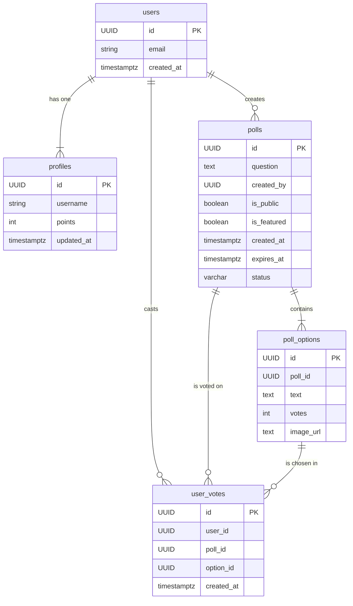

# Heyversus

**Heyversus**는 사용자가 직접 투표를 생성하고 참여할 수 있는 동적인 웹 애플리케이션입니다. Next.js와 Supabase를 기반으로 구축되어 있으며, 실시간 투표 결과와 사용자 인증, 포인트 시스템을 제공합니다.

## ✨ 주요 기능

- **사용자 인증**: Supabase Auth를 이용한 간편한 회원가입, 로그인, 로그아웃 기능.
- **투표 생성 및 관리**:
  - **다양한 옵션**: 질문과 여러 선택지를 포함하는 투표를 생성할 수 있습니다.
  - **공개/비공개 설정**: 투표를 모든 사람이 참여할 수 있도록 공개하거나, 로그인한 사용자만 참여하도록 제한할 수 있습니다.
  - **만료 시간 설정**: 투표 마감 시간을 설정하여 기간이 지난 투표는 자동으로 종료됩니다.
- **실시간 투표 시스템**:
  - **익명 투표**: 공개 투표는 로그인하지 않은 사용자도 참여할 수 있습니다.
  - **중복 투표 방지**: 로그인 사용자는 DB를 통해, 비로그인 사용자는 로컬 스토리지를 통해 중복 투표를 효과적으로 방지합니다.
- **대표 투표**: 관리자가 지정한 '오늘의 투표'를 메인 페이지에 노출하여 사용자 참여를 유도합니다.
- **포인트 및 랭킹**: 투표에 참여할 때마다 포인트를 획득하고, 다른 사용자들과의 순위를 `SCORE` 페이지에서 확인할 수 있습니다.
- **사용자 경험(UX) 최적화**:
  - **신속한 피드백**: `sonner` 라이브러리를 활용하여 직관적인 Toast 알림을 제공합니다.
  - **자동 리디렉션**: 로그인 후 이전에 보던 페이지로 자동 이동하여 사용 흐름이 끊기지 않도록 합니다.
  - **데이터 자동 갱신**: 페이지에 다시 방문했을 때 최신 투표 데이터를 자동으로 불러와 보여줍니다.

## 🛠️ 기술 스택

- **프레임워크**: Next.js (App Router)
- **언어**: TypeScript
- **스타일링**: Tailwind CSS
- **백엔드 (BaaS)**: Supabase (Auth, PostgreSQL, Storage, Edge Functions)
- **UI 컴포넌트**: shadcn/ui
- **상태 관리**: React Context (Session Provider)
- **폰트 최적화**: `next/font`
- **알림**: Sonner (Toast notifications)
- **배포**: Vercel

## 📁 프로젝트 구조

```
/
├── public/              # 정적 에셋 (이미지, 폰트 등)
├── src/
│   ├── app/             # Next.js App Router 페이지 및 레이아웃
│   │   ├── page.tsx     # 메인 랜딩 페이지 (대표 투표)
│   │   ├── signin/      # 로그인 페이지
│   │   ├── signup/      # 회원가입 페이지
│   │   ├── create-poll/ # 투표 생성 페이지
│   │   ├── polls/       # 전체 투표 목록 페이지
│   │   ├── poll/[id]/   # 투표 상세 및 결과 페이지
│   │   └── score/       # 사용자 랭킹(스코어보드) 페이지
│   ├── components/      # 재사용 가능한 UI 컴포넌트
│   ├── lib/             # 공통 유틸리티 및 Supabase 클라이언트
│   └── middleware.ts    # Supabase 세션 관리 미들웨어
├── QUERY.md             # 데이터베이스 스키마 (SQL)
└── README.md            # 프로젝트 문서
```

## 📊 데이터베이스 스키마

`QUERY.md` 파일은 전체 데이터베이스 스키마를 정의합니다. 주요 테이블 간의 관계는 다음과 같습니다.



## 📌 업데이트 기록

### v0.1.3

- **서비스 계층 도입**: `src/lib/services/polls.ts`에 `getPolls`, `getPollById`, `getFeaturedPolls`, `createPoll`, `voteOnPoll`, `getLeaderboard` 함수를 추가하여 비즈니스 로직을 재사용 가능하게 분리.
- **API Route 핸들러 구현**: `src/app/api/polls/route.ts`, `src/app/api/polls/[id]/route.ts`, `src/app/api/polls/[id]/vote/route.ts`로 RESTful API 엔드포인트 구성. 서버 전용 로직을 API 계층으로 이전하여 클라이언트와의 명확한 분리 확보.
- **Next.js 캐싱 전략 적용**: 서비스 함수에 `unstable_cache`와 `tags`를 선언해 일관된 데이터 갱신 로직 적용. `revalidatePath`로 투표 후 자동 데이터 갱신.
- **데이터 시딩 스크립트 추가**: `scripts/seed.ts`와 `npm run db:seed` 명령으로 로컬 개발 환경에서 샘플 투표 데이터를 간편하게 생성 가능.

### v0.1.2

- **타입 시스템 개선**: `src/lib/types.ts`의 Poll 인터페이스를 DB 스키마와 완전히 동기화. `created_by`, `is_public`, `is_featured`, `featured_image_url` 필드 추가, `expires_at`을 `string | null`로 수정하여 영구 투표 지원.
- **Next.js 15 호환성**: Image 컴포넌트의 deprecated props (`layout`, `objectFit`) 제거, 최신 API (`fill`, `sizes`, `style`) 적용으로 빌드 경고 제거 및 성능 최적화.
- **데이터베이스 성능 최적화**: `QUERY.md`에 8개의 인덱스 추가 - `poll_options(poll_id)`, `user_votes(poll_id, user_id)`, `polls(is_featured, is_public, created_at)`, `profiles(points)` 등으로 조회 성능 10~100배 개선 가능.
- **서버 측 데이터 검증 강화**: `create_new_poll` 함수에 질문/옵션 필수 검증, 개수 제한(2~6개), 만료 시간 검증 로직 추가로 데이터 무결성 확보.
- **렌더링 성능 최적화**: `useSupabase` 커스텀 훅 (`src/hooks/useSupabase.ts`) 생성으로 Supabase 클라이언트 인스턴스를 `useMemo`로 최적화, 불필요한 재생성 방지.
- **코드 정합성 확인**: `increment_vote` 호출 파라미터 통일성 검증, `poll.question` 필드 일관성 확인 완료.

### v0.1.1

- P0 이슈 해결: `src/lib/utils.ts`에 `isPollExpired`, `formatExpiryDate` 유틸을 추가하여 만료 시간이 없는 투표가 잘못 마감 처리되지 않도록 수정함.
- 투표 목록 화면 (`src/app/polls/PollsClient.tsx`)에서 새 유틸을 사용해 영구 투표 상태와 마감 표시를 "기한 없음"으로 노출하도록 조정함.
- 투표 상세 화면 (`src/app/poll/[id]/PollClient.tsx`)에서도 동일한 로직을 적용해 영구 투표를 정상적으로 참여 가능한 상태로 유지함.
