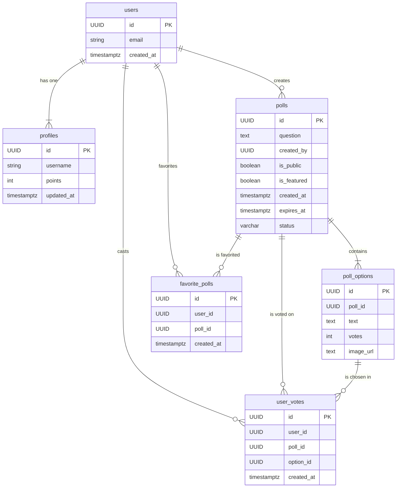

# Heyversus

🔗 Production (Vercel): https://heyversus.vercel.app/

**Heyversus**는 사용자가 직접 투표를 생성하고 참여할 수 있는 동적인 웹 애플리케이션입니다. Next.js와 Supabase를 기반으로 구축되어 있으며, 실시간 투표 결과와 사용자 인증, 포인트 시스템을 제공합니다.

## ✨ 주요 기능

- **사용자 인증**: Supabase Auth를 이용한 간편한 회원가입, 로그인, 로그아웃 기능.
- **투표 생성 및 관리**:
  - **다양한 옵션**: 질문과 여러 선택지를 포함하는 투표를 생성할 수 있습니다.
  - **공개/비공개 설정**: 투표를 모든 사람이 참여할 수 있도록 공개하거나, 로그인한 사용자만 참여하도록 제한할 수 있습니다.
  - **만료 시간 설정**: 투표 마감 시간을 설정하여 기간이 지난 투표는 자동으로 종료됩니다.
- **실시간 투표 시스템**:
  - **익명 투표**: 공개 투표는 로그인하지 않은 사용자도 참여할 수 있습니다.
  - **중복 투표 방지**: 로그인 사용자는 DB를 통해, 비로그인 사용자는 로컬 스토리지를 통해 중복 투표를 효과적으로 방지합니다.
- **대표 투표**: 관리자가 지정한 '오늘의 투표'를 메인 페이지에 노출하여 사용자 참여를 유도합니다.
- **포인트 및 랭킹**: 투표에 참여할 때마다 포인트를 획득하고, 다른 사용자들과의 순위를 `SCORE` 페이지에서 확인할 수 있습니다.
- **즐겨찾기 관리**: 로그인 사용자는 관심 있는 투표를 즐겨찾기에 추가하고 `/favorites` 페이지에서 모아볼 수 있습니다.
- **사용자 경험(UX) 최적화**:
  - **신속한 피드백**: `sonner` 라이브러리를 활용하여 직관적인 Toast 알림을 제공합니다.
  - **자동 리디렉션**: 로그인 후 이전에 보던 페이지로 자동 이동하여 사용 흐름이 끊기지 않도록 합니다.
  - **데이터 자동 갱신**: 페이지에 다시 방문했을 때 최신 투표 데이터를 자동으로 불러와 보여줍니다.

## 🛠️ 기술 스택

- **프레임워크**: Next.js (App Router)
- **언어**: TypeScript
- **스타일링**: Tailwind CSS
- **백엔드 (BaaS)**: Supabase (Auth, PostgreSQL, Storage, Edge Functions)
- **UI 컴포넌트**: shadcn/ui, Tailwind CSS 유틸리티 + `class-variance-authority`
- **데이터 페칭**: `@tanstack/react-query`
- **상태 관리**: React Query 캐시, Zustand 스토어, Supabase Session Provider
- **폰트 최적화**: `next/font`
- **알림**: Sonner (Toast notifications)
- **에러 모니터링**: Sentry (Error tracking, Performance monitoring, Session replay)
- **배포**: Vercel

## 📁 프로젝트 구조

```
/
├── public/              # 정적 에셋 (이미지, 폰트 등)
├── src/
│   ├── app/               # Next.js App Router 페이지 및 레이아웃
│   │   ├── api/           # RESTful API Route handlers
│   │   ├── page.tsx       # 메인 랜딩 페이지 (대표 투표)
│   │   ├── signin/        # 로그인 페이지
│   │   ├── signup/        # 회원가입 페이지
│   │   ├── create-poll/   # 투표 생성 페이지
│   │   ├── polls/         # 전체 투표 목록 페이지
│   │   ├── favorites/     # 즐겨찾기한 투표 목록 페이지
│   │   ├── poll/[id]/     # 투표 상세 및 결과 페이지
│   │   └── score/         # 사용자 랭킹(스코어보드) 페이지
│   ├── components/        # 재사용 가능한 UI 컴포넌트
│   │   ├── common/        # 공통 UI 컴포넌트 (Skeleton, ErrorState, EmptyState)
│   │   ├── layout/        # 레이아웃 컴포넌트 (Navbar)
│   │   └── ui/            # shadcn/ui 기본 컴포넌트
│   ├── constants/         # 애플리케이션 상수 (storage, cache, defaults)
│   ├── hooks/             # 재사용 가능한 커스텀 훅
│   │   ├── useSession.ts          # Supabase 세션 관리
│   │   ├── useLocalStorage.ts     # 타입 안전 localStorage 동기화
│   │   ├── useVisibilityChange.ts # 페이지 가시성 감지
│   │   ├── useSupabase.ts         # Supabase 클라이언트 최적화
│   │   ├── usePollVote.ts         # 투표 참여 Optimistic Update
│   │   └── useToggleFavorite.ts   # 즐겨찾기 토글
│   ├── lib/               # 공통 유틸리티, Supabase 클라이언트 및 서비스 계층
│   │   ├── services/      # Supabase RPC를 감싼 비즈니스 로직
│   │   └── stores/        # Zustand 기반 전역 상태
│   ├── providers/         # React Query 등 글로벌 Provider 구성
│   └── middleware.ts      # Supabase 세션 관리 미들웨어
├── QUERY.md             # 데이터베이스 스키마 (SQL)
├── ROADMAP.md           # 개발 로드맵 및 진행 현황
└── README.md            # 프로젝트 문서
```

## 🚀 시작하기

1. 저장소를 클론합니다.
   ```bash
   git clone https://github.com/ChoiKyeongHoon/heyversus.git
   cd heyversus
   ```
2. 의존성을 설치합니다.
   ```bash
   npm install
   ```
3. 환경 변수를 설정합니다. `.env.local` 파일을 생성하고 아래 키를 채웁니다.

   ```bash
   # Supabase
   NEXT_PUBLIC_SUPABASE_URL=<your-supabase-url>
   NEXT_PUBLIC_SUPABASE_ANON_KEY=<your-supabase-anon-key>
   SUPABASE_SERVICE_ROLE_KEY=<optional-service-role-key-for-seeding>

   # Sentry (선택사항 - 에러 모니터링)
   NEXT_PUBLIC_SENTRY_DSN=<your-sentry-dsn>
   SENTRY_ORG=<your-sentry-org>
   SENTRY_PROJECT=<your-sentry-project>
   SENTRY_AUTH_TOKEN=<your-sentry-auth-token>
   ```

   `.env.local.example` 파일을 참고하세요.

4. 개발 서버를 실행합니다.
   ```bash
   npm run dev
   ```
5. (선택) 샘플 데이터를 넣으려면 Supabase에 로그인된 상태에서 시딩 스크립트를 실행합니다.
   ```bash
   npm run db:seed
   ```
6. 변경 사항을 커밋하기 전에 린트를 실행합니다.
   ```bash
   npm run lint
   ```
7. Jest 기반 단위 테스트를 실행하려면 아래 명령을 사용합니다.
   ```bash
   npm run test
   ```

## 📊 데이터베이스 스키마

`QUERY.md` 파일은 전체 데이터베이스 스키마를 정의합니다. 주요 테이블 간의 관계는 다음과 같습니다.



## 📌 업데이트 기록 (0.1.1부터 0.3.1까지 10월 21일 제출 내역)

### v0.3.1

- **비공개 투표 접근 제어 완성**: Supabase RLS 정책과 `can_access_poll`, `get_my_polls_with_user_status` RPC를 적용해 로그인한 생성자만 자신의 비공개 투표를 조회·진입할 수 있도록 보장했습니다.
- **API 응답 일관성 개선**: `get_polls_with_user_status`, `get_poll_with_user_status`를 업데이트해 권한이 없는 경우 빈 결과를 돌려주고 클라이언트가 안전하게 404로 처리할 수 있게 했습니다.
- **프론트엔드 UX 보완**: `/poll/[id]` 진입 시 접근 권한 검사와 404 핸들링을 강화하고, EmptyState 안내 문구를 조정해 비공개 투표 안내를 명확히 했습니다.
- **QA 및 검증**: `npm run lint`, `npm run build` 를 통과했으며, 로그인/로그아웃 플로우에서 비공개 투표 접근 동작을 수동으로 검증했습니다.

### v0.3.0

- **코드 재사용성 대폭 향상**: 15곳 이상의 localStorage 중복 코드와 6곳의 visibilitychange 리스너를 커스텀 훅으로 통합. `useSession`, `useLocalStorage<T>`, `useVisibilityChange` 훅을 새로 생성해 재사용 가능한 로직 분리.
- **상수 중앙화**: `src/constants/` 디렉터리를 추가하고 `STORAGE_KEYS`, `CACHE_TAGS`, `CACHE_TIMES`, `DEFAULTS` 등 매직 스트링/넘버를 한 곳에서 관리. 코드 일관성 및 유지보수성 개선.
- **컴포넌트 구조 개선**: `components/layout/` 디렉터리를 생성하고 Navbar 컴포넌트를 이동. App Router 컨벤션에 맞춰 `*Client.tsx` 컴포넌트는 해당 route 디렉터리에 유지.
- **타입 안전성 강화**: `useLocalStorage<T>` 제네릭 훅으로 localStorage 사용 시 타입 안전성 보장. 다른 탭/윈도우 간 storage 이벤트 동기화 지원.
- **Sentry 통합**: `@sentry/nextjs`를 도입하여 프로덕션 에러 모니터링, 성능 추적, 세션 리플레이 기능 추가. Error Boundary (`error.tsx`, `global-error.tsx`)로 에러 자동 캡처 및 사용자 친화적 UI 제공. `/test-sentry` 페이지로 통합 테스트 가능. (사용 여부 추후 결정)
- **코드 품질**: `npm run lint` 및 `npm run build` 모두 통과. 런타임 에러 없이 모든 페이지 정상 작동 확인.

### v0.2.1

- **Hydration 대응**: 대표 투표 카드의 만료 시간을 `Intl.DateTimeFormat('ko-KR')`으로 고정 포맷해 서버/클라이언트 렌더 결과를 일치시켰습니다.
- **Developer Experience**: Husky + lint-staged 기반 pre-commit 검사와 Jest 유틸 테스트 러너를 추가해 변경 시 자동 품질 체크가 이뤄집니다.
- **문서 업데이트**: README에 린트/테스트 실행 절차 및 새 개발 흐름을 명시했습니다.

### v0.2.0

- **즐겨찾기 데이터 모델**: Supabase에 `favorite_polls` 테이블, RLS, 인덱스를 추가하고, `toggle_favorite`·`get_favorite_polls` RPC로 즐겨찾기 토글과 조회를 캡슐화했습니다.
- **서비스 & 타입 확장**: `src/lib/services/polls.ts`에 즐겨찾기 헬퍼를 추가하고 `PollWithOptions` 타입에 `is_favorited` 필드를 도입했습니다.
- **클라이언트 UX**: `PollsClient`에 즐겨찾기 버튼 및 Optimistic 업데이트를 적용하고, 로그인 유도/빈 상태 안내를 개선했습니다.
- **전용 페이지**: `/favorites` 라우트를 추가해 즐겨찾기된 투표를 별도로 열람·관리할 수 있도록 했으며, 네비게이션에 `FAVORITES` 메뉴를 노출했습니다.
- **테스트 & 문서화**: `npm run lint`와 수동 QA(즐겨찾기 추가/삭제/미로그인 흐름)를 완료하고 `QUERY.md`·`README.md`에 관련 내용을 업데이트했습니다.

### v0.1.4

- **React Query 도입**: `@tanstack/react-query`를 설치하고 `QueryProvider`로 전역 설정. 투표 기능에 Optimistic Update 적용하여 즉각적인 UI 피드백 제공, 에러 발생 시 자동 롤백 처리.
- **공통 UI 컴포넌트 표준화**: `src/components/common`에 `Skeleton`, `ErrorState`, `EmptyState` 컴포넌트 추가. 로딩, 에러, 빈 상태에 대한 일관된 사용자 피드백 제공.
- **Zustand 전역 상태 관리**: `src/lib/stores`에 `usePollStore`, `useUIStore` 생성. 투표 상태와 UI 상태(모달, 사이드바)를 경량 스토어로 관리.
- **Tailwind 디자인 시스템 확장**: `src/components/ui`에 `Card`, `Badge`, `Input` 컴포넌트 추가. 재사용 가능한 UI 컴포넌트로 스타일 일관성 확보.
- **로딩 상태 개선**: `src/app/polls/loading.tsx`, `src/app/poll/[id]/loading.tsx` 추가로 페이지 전환 시 Skeleton UI 표시.
- **빈 상태 처리**: 투표 목록이 비어있을 때 `EmptyState` 컴포넌트로 안내 메시지와 CTA 제공.

### v0.1.3

- **서비스 계층 도입**: `src/lib/services/polls.ts`에 `getPolls`, `getPollById`, `getFeaturedPolls`, `createPoll`, `voteOnPoll`, `getLeaderboard` 함수를 추가하여 비즈니스 로직을 재사용 가능하게 분리.
- **API Route 핸들러 구현**: `src/app/api/polls/route.ts`, `src/app/api/polls/[id]/route.ts`, `src/app/api/polls/[id]/vote/route.ts`로 RESTful API 엔드포인트 구성. 서버 전용 로직을 API 계층으로 이전하여 클라이언트와의 명확한 분리 확보.
- **Next.js 캐싱 전략 적용**: 서비스 함수에 `unstable_cache`와 `tags`를 선언해 일관된 데이터 갱신 로직 적용. `revalidatePath`로 투표 후 자동 데이터 갱신.
- **데이터 시딩 스크립트 추가**: `scripts/seed.ts`와 `npm run db:seed` 명령으로 로컬 개발 환경에서 샘플 투표 데이터를 간편하게 생성 가능.

### v0.1.2

- **타입 시스템 개선**: `src/lib/types.ts`의 Poll 인터페이스를 DB 스키마와 완전히 동기화. `created_by`, `is_public`, `is_featured`, `featured_image_url` 필드 추가, `expires_at`을 `string | null`로 수정하여 영구 투표 지원.
- **Next.js 15 호환성**: Image 컴포넌트의 deprecated props (`layout`, `objectFit`) 제거, 최신 API (`fill`, `sizes`, `style`) 적용으로 빌드 경고 제거 및 성능 최적화.
- **데이터베이스 성능 최적화**: `QUERY.md`에 8개의 인덱스 추가 - `poll_options(poll_id)`, `user_votes(poll_id, user_id)`, `polls(is_featured, is_public, created_at)`, `profiles(points)` 등으로 조회 성능 10~100배 개선 가능.
- **서버 측 데이터 검증 강화**: `create_new_poll` 함수에 질문/옵션 필수 검증, 개수 제한(2~6개), 만료 시간 검증 로직 추가로 데이터 무결성 확보.
- **렌더링 성능 최적화**: `useSupabase` 커스텀 훅 (`src/hooks/useSupabase.ts`) 생성으로 Supabase 클라이언트 인스턴스를 `useMemo`로 최적화, 불필요한 재생성 방지.
- **코드 정합성 확인**: `increment_vote` 호출 파라미터 통일성 검증, `poll.question` 필드 일관성 확인 완료.

### v0.1.1

- P0 이슈 해결: `src/lib/utils.ts`에 `isPollExpired`, `formatExpiryDate` 유틸을 추가하여 만료 시간이 없는 투표가 잘못 마감 처리되지 않도록 수정함.
- 투표 목록 화면 (`src/app/polls/PollsClient.tsx`)에서 새 유틸을 사용해 영구 투표 상태와 마감 표시를 "기한 없음"으로 노출하도록 조정함.
- 투표 상세 화면 (`src/app/poll/[id]/PollClient.tsx`)에서도 동일한 로직을 적용해 영구 투표를 정상적으로 참여 가능한 상태로 유지함.
